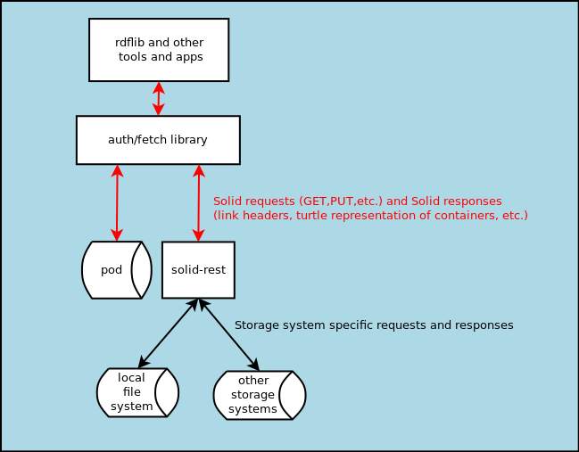

# Solid REST

## treat any storage backend as a minimal Solid server

<!--

-->

This package sits between auth modules like solid-auth-client and solid-auth-cli to handle requests for file:// and app:// URIs. and then uses the appropriate storage module to do the work.  Doing it this way means that any app that uses those auth modules (which AFAIK is all Solid apps) can make use of the extended storage spaces.  The file:// portion is already working in rdflib in nodejs.  So far I have backends working for a file-system and for localStorage.  Files work only in node; localStorage works either in browser or node (using a simulated in-memory localStorage).  Otto_A_A is working on a cache backend which will use web-workers to dynamically update a mini-pod in the browser's cache.  

This package provides request routing, header handling, response preparation, and a test framework.  Storage modules can leverage all of that and/or over-ride what they want.  I am preparing an API guide, in the meantime there is documentation in the [localStorage](./src/localStorage.js).

copyright &copy; 2019, Jeff Zucker, may be freely distributed with the MIT license
